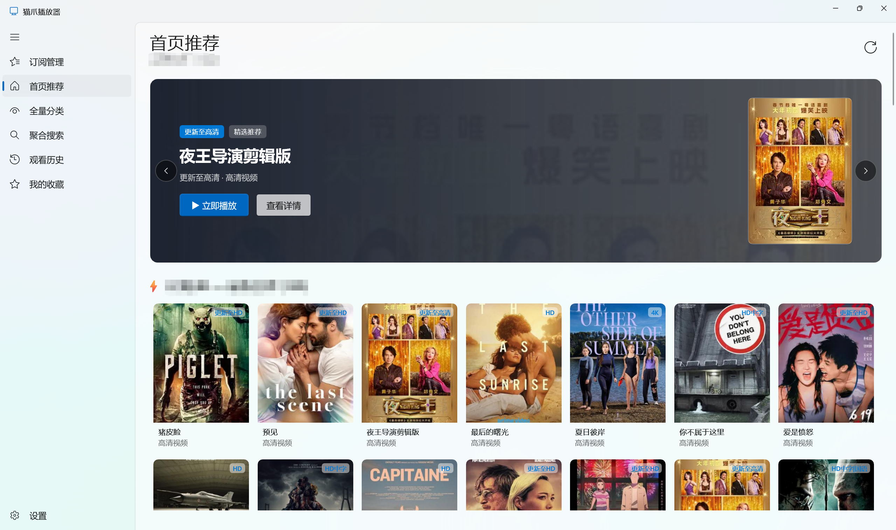
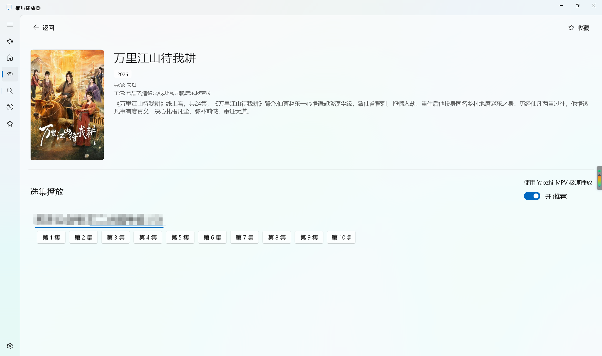
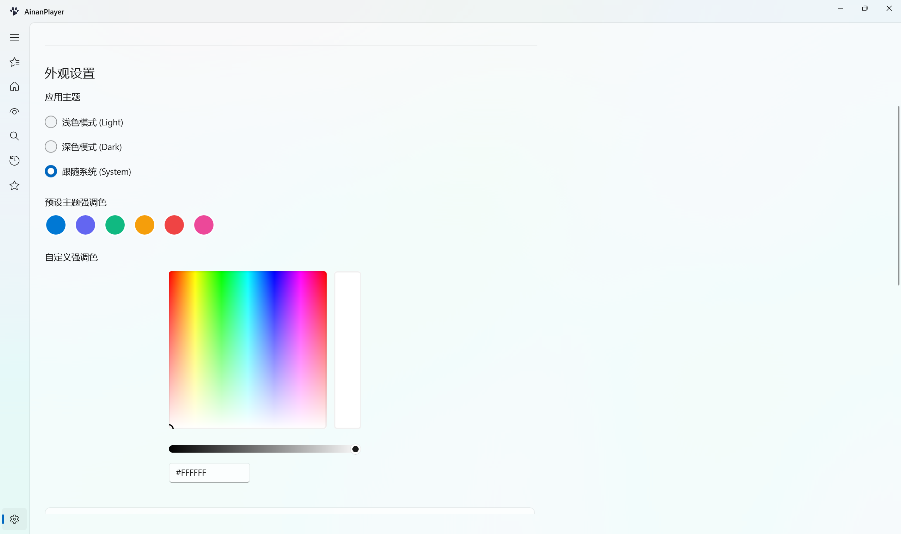
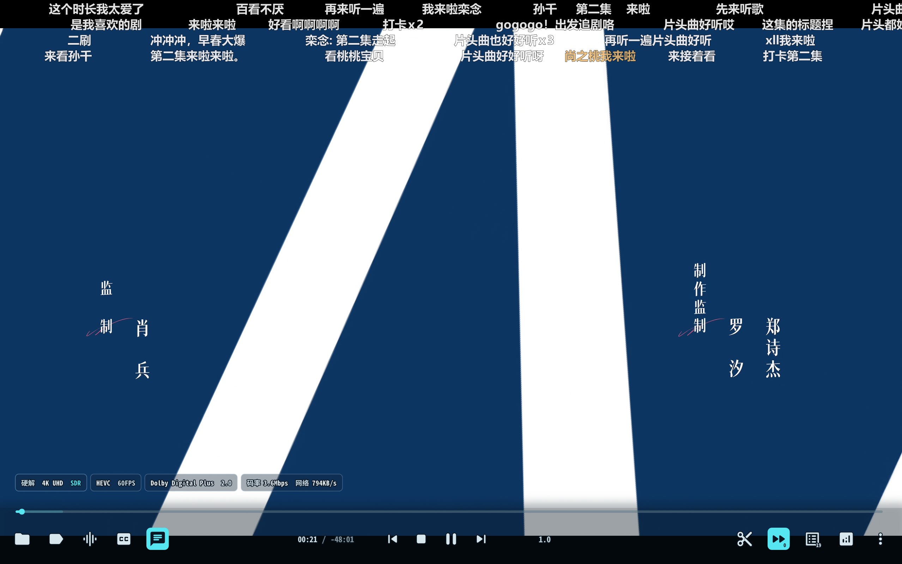

#  CatPawPlayer (AinanPlayer)
### Modern Windows 11 Media Aggregator & 4K UHD Hardware-Accelerated Player

[简体中文](README_zh.md) | **English**

[**Downloads**](#download--installation) • [**User Guide**](docs/USER_GUIDE.md) • [**Screenshots**](#screenshots) • [**Key Features**](#key-features) • [**System Requirements**](#system-requirements) • [**Config Center**](#config-center--cloud-drive-authorization) • [**Community**](#community--feedback) • [**Disclaimer**](#disclaimer) • [**Support**](#support-the-project) • [**Credits & License**](#credits--license)

---

## Screenshots

### Home Featured Recommendations & Dynamic Poster Stream (Apple TV Style Fluid UI)

 

### Movie Details & Multi-Source Quick Selection (Supports Yaozhi-MPV Hardware Acceleration)

 

### Appearance & Theme Customization (Seamless Dark/Light Mode & Accent Color Picker)

 

### 4K 60FPS Hardware Acceleration & Playback (Real-Time Decoding Metadata & Bitrate)

---

## Key Features

* **Native WinUI 3 + Fluent 2 Design System**: Built with Windows App SDK 1.6 and Mica/Acrylic materials, supporting seamless real-time switching between Light, Dark, and System theme modes.
* **Universal Multi-Engine Spider Architecture**:
  * Supports TVBox JSON repositories, `.js.md5` modules, Base64-encrypted feeds, and standalone CMS endpoints.
  * Isolated multi-port local microservice architecture for ultra-fast, robust crawling and parsing.
* **Dual Playback Engine & 4K HDR Hardware Acceleration**:
  * **Yaozhi-MPV Integration**: Launch external high-performance MPV for 4K UHD, HEVC/H.265, Dolby Vision, and up to 120FPS ultra-smooth hardware decoding.
  * **Built-in Offline HLS Engine**: Integrated offline `hls.min.js` with zero external CDN dependencies for instant offline playback.
* **Embedded Cloud Drive Authorization Console**:
  * In-app QR code authentication for Quark, UC, Aliyun, Baidu, and 115 cloud drives without leaving the application.
* **Real Decoded Stream Metadata Detection**:
  * Captures real decoded video dimensions (e.g. `1920×1080`, `3840×2160`), video/audio codecs, and live bitrate in the top player HUD.
* **Multi-Engine Aggregate Search & Categorized Exploration**:
  * Search across all subscribed providers concurrently and explore multi-dimensional genre filters effortlessly.
* **Bilingual Support (English & Simplified Chinese)**:
  * Full in-app language switching with real-time UI hot-reload.

---

## System Requirements

* **Operating System**: Windows 10 (Version 1809 / Build 17763 or later) or Windows 11 (64-bit)
* **Dependencies**: Self-contained packages with all runtimes bundled (no extra frameworks required)
* **External Player (Optional)**: For advanced MPV hardware acceleration, integrate with [mpv-Yaozhi](https://github.com/Yaozhil/mpv-Yaozhi)

---

## Download & Installation

Visit the [**Releases Page**](https://github.com/Ainanya21/CatPawPlayer/releases) to download the latest version:

| Package | Description | Recommended For |
| :--- | :--- | :--- |
| **`CatPawPlayer_vX.X.X_Setup.exe`** | Graphical Setup Wizard with desktop shortcut & in-app auto updates | Standard users (supports one-click in-app update) |
| **`CatPawPlayer_vX.X.X_Portable.zip`** | Portable archive (extract and run) | Portable USB drives & quick trial |

---

## Config Center & Cloud Drive Authorization

To stream 4K original quality media from cloud drives:

1. Open CatPawPlayer and navigate to **Categories** on the sidebar.
2. Select **Config Center** (or click the authorization prompt on netdisk titles).
3. Scan the QR code using your mobile cloud drive app (Quark / UC / Aliyun / Baidu / 115).
4. Once authorized, the local spider backend automatically retrieves fast streaming links!

---

## Community & Feedback

Join our official community groups for announcements, updates, and support:

* **Telegram Channel**: [https://t.me/CatPawPlayer](https://t.me/CatPawPlayer)
* **Telegram Discussion Group**: [https://t.me/CatPawPlayerChat](https://t.me/CatPawPlayerChat)

---

## Player Settings (MPV Hardware Acceleration)

Easily configure external MPV player:

1. Click **Settings** on the left sidebar.
2. Under **Player & Core Engine**:
   * Turn on **Enable External MPV Hardware Acceleration**.
   * Click **Browse...** to select your `mpv.exe` path (e.g., `D:\Yaozhi-MPV\mpv.exe`).
3. Video playback will now launch with MPV, supporting hardware decoding and playlist synchronization.

---

## Support the Project

If **CatPawPlayer (AinanPlayer)** enhances your entertainment and viewing experience, feel free to support developer efforts:

| WeChat Pay | Alipay |
| :---: | :---: |
|  |  |

> Your generous support helps keep this project actively maintained and continuously evolving. Thank you so much! ❤️

---

## Credits & License

We gratefully acknowledge and thank the following open-source projects and community foundations:

* **[mpv](https://mpv.io/) / [mpv-Yaozhi](https://github.com/Yaozhil/mpv-Yaozhi)**: High-performance cross-platform video renderer and hardware-accelerated decoding core.
* **[WinUI 3](https://github.com/microsoft/WindowsAppSDK) / [Windows App SDK](https://learn.microsoft.com/windows/apps/windows-app-sdk/)**: Microsoft modern native Windows Fluent 2 design system.
* **[CatVodSpider / TVBox Protocol Ecosystem](https://github.com/)**: Open-source crawler specifications and multi-source parsing architecture.
* **[hls.js](https://github.com/video-dev/hls.js/)**: JavaScript HLS streaming client.
* **[Fastify](https://fastify.dev/) / [Node.js](https://nodejs.org/)**: Asynchronous microservices middleware.
* **[Newtonsoft.Json](https://www.newtonsoft.com/json)**: High-performance JSON serialization for .NET.

---

## Disclaimer

1. **Local Tool Purpose**: **CatPawPlayer (AinanPlayer)** is strictly a local universal multimedia player and API client built on WinUI 3 and open-source media engines. The software does not provide, store, host, distribute, or stream any audio, video, subtitle, or media files.
2. **Third-Party Data Sources**: All subscriptions, crawler rules, and media endpoints are user-configured or sourced from public third-party networks. The developer accepts no legal liability or responsibility for the accuracy, legality, or availability of third-party content.
3. **Legal Compliance**: This project is for personal learning, technical research, and media decoding exploration only. Users must comply with applicable local laws and copyright regulations. Commercial use or unauthorized redistribution is strictly prohibited.

---

## License

Released under the [MIT License](LICENSE).
