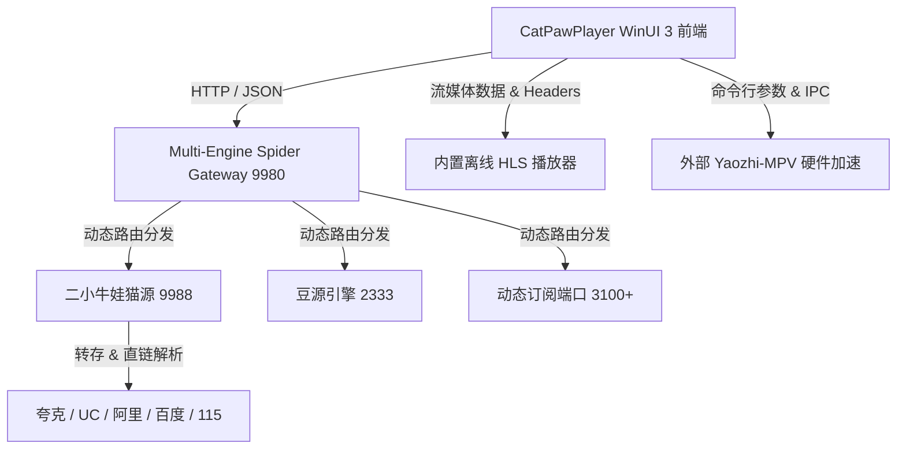

<div align="center">

# 🐾 猫爪播放器 (CatPawPlayer)
### 现代化 Windows 11 影视聚合与 4K 超清硬件加速播放平台

[](https://github.com/Ainanya21/CatPawPlayer)
[](https://github.com/Ainanya21/CatPawPlayer)
[](https://dotnet.microsoft.com/)
[](https://github.com/Ainanya21/CatPawPlayer)
[](LICENSE)

[**下载体验**](#-下载与安装) • [**核心功能**](#-核心亮点) • [**配置中心与网盘**](#-配置中心与网盘授权) • [**本地编译构建**](#-本地编译与开发) • [**使用指南**](#-使用指南)

</div>

---

## 🌟 核心亮点

* **💎 原生 WinUI 3 + Fluent 2 视觉体系**：基于微软最新 Windows App SDK 1.6 与 Mica / Acrylic 材质构建，支持全功能浅色/深色/跟随系统的主题实时无缝切换。
* **🚀 多引擎万能爬虫架构（Universal Multi-Engine Spider）**：
  * 支持 **王二小牛娃猫源**（`9988`）、**豆源**（`2333`）、以及统一控制网关（`9980`）。
  * 完美支持 `.js.md5`、Base64 加密订阅、标准 TVBox JSON 仓库以及单 CMS 接口的动态自动识别、热下载与多端口隔离加载。
* **🎬 双播放内核与 4K HDR 硬件加速**：
  * **Yaozhi-MPV 极速播放**：支持调用外部 MPV 高性能解码器，享受 4K UHD、HEVC/H.265、杜比视界（Dolby Vision）及 120FPS 极限硬件加速。
  * **内置离线 HLS 原生播放引擎**：内嵌完整的离线 `hls.min.js`，零外部 CDN 依赖，启动秒开，断网或离线环境下无障碍播放。
* **🛠️ 内嵌原生配置中心**：
  * 深度集成扫码与授权控制台，无需跳出浏览器，直接在应用内完成夸克、UC、阿里、百度、115 等网盘账号的扫码授权与转存配置。
* **📊 智能媒体流元数据实时探针**：
  * 自动侦测媒体流的分辨率、视频编码、音频编码、网络延迟以及多码率分片轨道，在播放详情页即时呈现 4K / 1080P / HDR / 杜比全景声 徽章。
* **🔍 全网聚合搜索与多维分类筛选**：
  * 支持跨源异步并发聚合搜索与多级分类展开筛选，一键检索全网优质资源。

---

## 📦 下载与安装

进入 [**Releases 发布页面**](https://github.com/Ainanya21/CatPawPlayer/releases) 下载最新安装包：

| 文件类型 | 说明 | 适用场景 |
| :--- | :--- | :--- |
| **`CatPawPlayer_v1.0.3_Setup.exe`** | 现代图形化安装向导，支持自定义路径、桌面快捷方式 | 推荐大多数用户使用，支持覆盖更新升级 |
| **`CatPawPlayer_v1.0.3_Portable.zip`** | 绿色免安装解压即用版 | 适合便携 U 盘或快速体验 |

---

## 🛠️ 配置中心与网盘授权

为了畅快播放网盘 4K 原画资源（如至臻、玩偶、指南等聚合源），请先完成网盘授权：

1. 打开猫爪播放器，点击左侧导航栏 **「全量分类」**。
2. 站点下拉框选择 **「🛠️ 配置中心」**（或点击网盘片源详情页上的授权引导按钮）。
3. 使用手机对应网盘 APP（夸克 / UC / 阿里云盘 / 百度网盘 / 115）扫码登录。
4. 授权成功后，爬虫后端将在播放 4K 资源时自动进行秒级转存并换取高速原画播放直链！

---

## 💻 播放器设置（MPV 硬件加速）

猫爪播放器支持自由选择内置播放器或外部 MPV 播放器：

1. 点击左侧导航栏 **「设置」**。
2. 在 **「播放器设置」** 中：
   * 勾选 **「启用外部 MPV 硬件加速播放」**。
   * 点击 **「浏览...」** 选择您的 `mpv.exe` 路径（如 `D:\Yaozhi-MPV\mpv.exe`）。
3. 在视频详情页即可使用 MPV 播放，支持硬件解码、记忆断点以及快捷键控制。

---

## 🏗️ 架构与技术栈



### 技术架构清单

* **UI 前端**：.NET 8.0, C#, WinUI 3, Windows App SDK 1.6, XAML
* **爬虫服务端**：Node.js Runtime, Fastify, CatVod Spider API, Multi-Port Engine Host
* **流媒体解析**：内置 HLS.js 离线引擎 + StreamMetadataService 深度嗅探
* **安装程序**：.NET 8 WinForms 自定义图形化解压与快捷方式安装向导

---

## 🔨 本地编译与开发

### 环境要求

* Windows 10 (19041+) 或 Windows 11
* [Visual Studio 2022](https://visualstudio.microsoft.com/)（勾选「.NET 桌面开发」与「Windows 应用程序开发」工作负载）
* [.NET 8.0 SDK](https://dotnet.microsoft.com/download/dotnet/8.0)
* [Node.js](https://nodejs.org/) (v18.0 或更高版本)

### 克隆与编译

```bash
# 1. 克隆代码仓库
git clone https://github.com/Ainanya21/CatPawPlayer.git
cd CatPawPlayer

# 2. 编译主程序 (Release)
dotnet build CatPawPlayer.WinUI/CatPawPlayer.WinUI.csproj -c Release

# 3. 打包便携版与安装程序
node create_packages.js
dotnet publish CatPawPlayer.Installer/CatPawPlayer.Installer.csproj -c Release -r win-x64 --self-contained true -p:PublishSingleFile=true -o "./dist"
```

编译生成的安装程序和便携压缩包将保存在 `dist/` 目录下。

---

## 📄 开源许可

本项目基于 [MIT 许可证](LICENSE) 开源。

> **免责声明**：本项目仅供编程技术交流与个人学习使用，软件本身不提供、不上传、不存储任何影视音视频资源。所有播放源均来自于用户自行填写的公开网络接口。请在符合当地法律法规的前提下使用。
